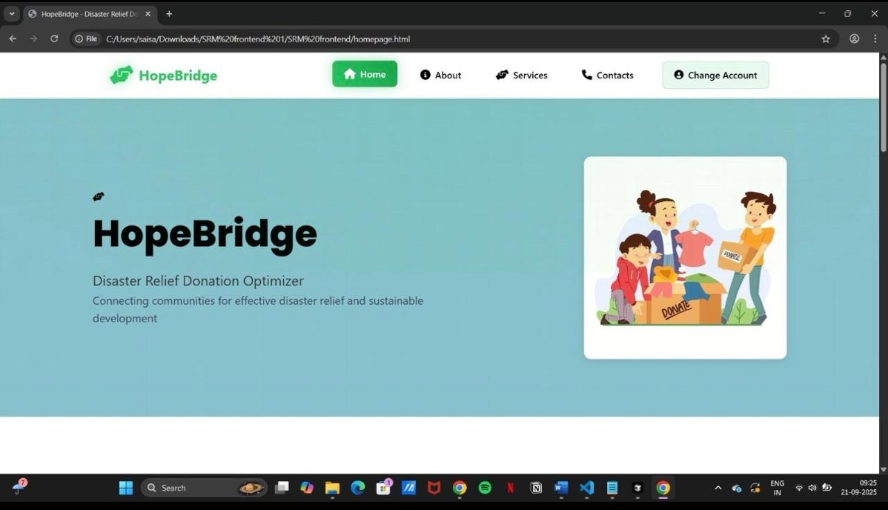
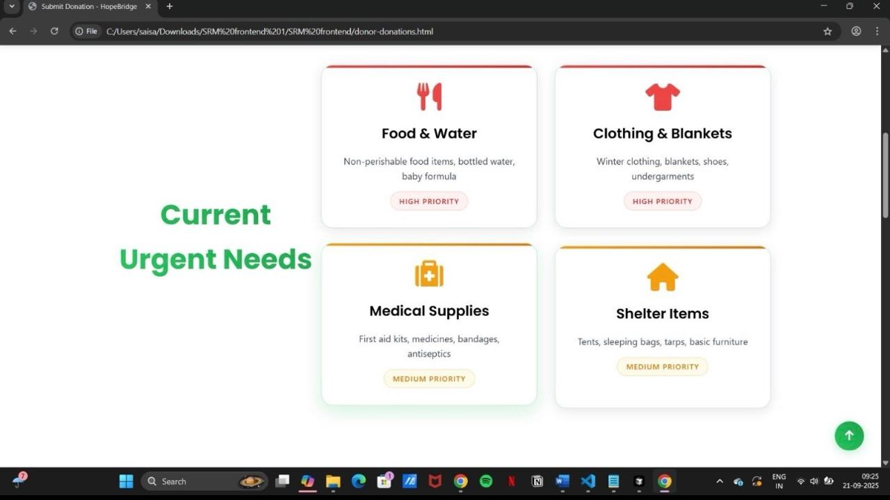
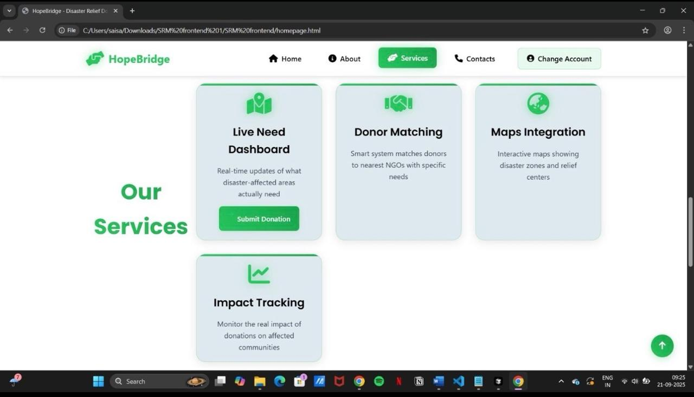

# HopeBridge

## Disaster Relief Donation Platform

HopeBridge is a web-based disaster relief donation platform developed during the Global Goals Hackathon hosted by AIESEC Amaravati at SRM University AP.

The project aims to connect donors with verified NGOs and relief camps to ensure that essential resources reach affected communities efficiently.

## Problem Statement

During disasters, donations often fail to reach areas with the greatest need due to lack of visibility, coordination, and transparency.

HopeBridge was designed to address this challenge through a centralized platform.

## Features

- Real-time needs dashboard
- Smart donor matching
- NGO and relief camp integration
- SOS assistance portal
- Donation tracking and transparency
- Resource allocation support

## Technologies Used

- HTML
- CSS
- JavaScript

## Hackathon Achievement

Selected among the Top 10 teams during the Global Goals Hackathon.

## Team

Team Igniters

## Screenshots

### Home Page

### Current Needs

### Services

